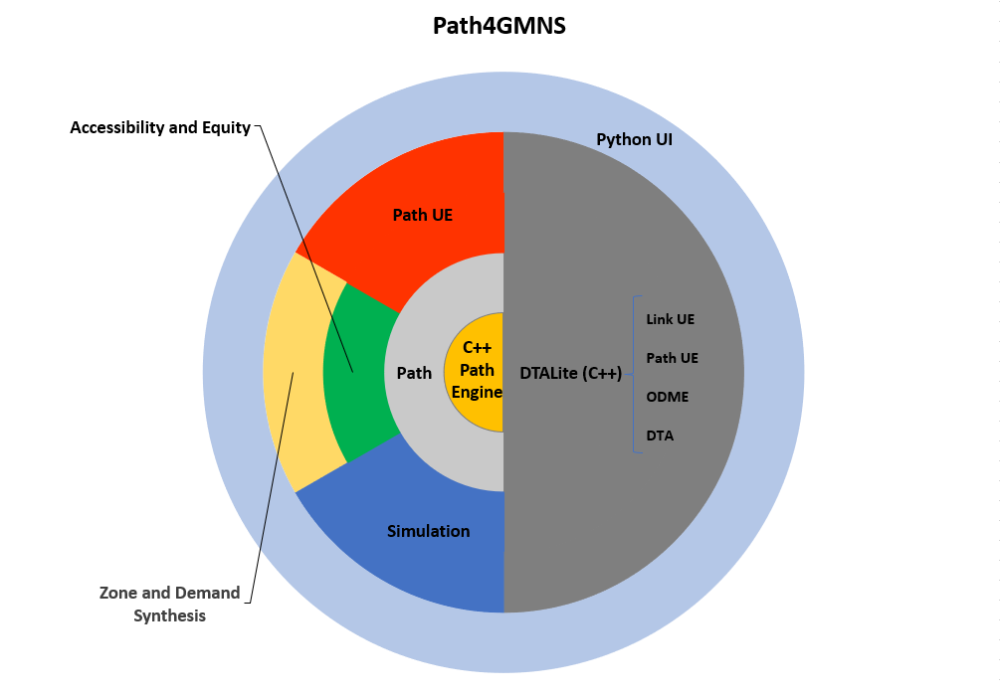

# path4GMNS-case
This tutorial provides a brief introduction to the Path4GMNS, highlighting the DTALite functional modules within it. 
Whether you want to use Path4GMNS seriously or want to contribute to the project, it may be helpful to understand its functional structure and data examples. The tutorial will show you the macro structure of Path4GMNS and the basics of how to install and use it, with specific data examples in the nine subsequent documents. Before you learn about the data cases we provide and use Path4GMNS, it is recommended that you go through the contents of this tutorial to get an initial understanding of Path4GMNS and complete its installation and configuration.

## 1. High-level of Path4GMNS

Path4GMNS is an open-source, cross-platform, lightweight, and fast Python path engine for networks encoded in [GMNS](https://github.com/zephyr-data-specs/GMNS). Besides finding static shortest paths for simple analyses, its main functionality is to provide an efficient and flexible framework for column-based (path-based) modeling and applications in transportation (e.g., activity-based demand modeling). Path4GMNS supports, in short,

1. finding (static) shortest path between two nodes,
2. performing path-based User-Equilibrium (UE) traffic assignment,
3. conducting dynamic traffic assignment (DTA) after UE.
4. evaluating multimodal accessibility and equity,
5. synthesizing zones and Origin-Destination (OD) demand for a given network.

Path4GMNS also serves as an API to the C++-based [DTALite](https://github.com/jdlph/DTALite) to conduct various multimodal traffic assignments including,
   * Link-based UE,
   * Path-based UE,
   * UE + DTA,
   * OD Matrix Estimation (ODME).

## 2. Installation and Configuration
The Python modules are written in Python 3.x, which is the minimum requirement to explore the most of Path4GMNS. 
### i. How to install path4gmns
    pip install path4gmns

### ii. How to update path4gmns
    pip install path4gmns --upgrade

### iii. Please use the latest version (0.9.7) for your projects.
v0.9.7 serves as a hotfix over v0.9.5 and v0.9.6 on emitting DTALite log and synthesizing zone and demand. Please **update to or install the latest version** and **discard all old versions**.

> **[WARNING]**  
> Any versions prior to v0.9.4 will generate INCORRECT simulation results.
> Calling DTALite and [synthesizing zones and OD demand are not functioning for v0.9.5 and v0.9.6](https://github.com/jdlph/Path4GMNS/issues/41).

### Python interface to call the latest DTALite:
    path4gmns.run_DTALite()
> Before using this function, please make sure that you have placed the node.csv, link.csv and demand.csv files required by DTAlite in the sibling folder. Other data files can be generated with default settings by the programme, or configured by yourself. For more details about the data preparation, please check [the user-guide doc of DTALite](https://github.com/asu-trans-ai-lab/DTALite/tree/main/docs/user_guide).

This version of DTALite includes all-new Logbook, enhanced scenario handling, improved I/O functionality, and so on.
Its source code can be found at https://github.com/asu-trans-ai-lab/DTALite. 
This series of tutorials provides you with 9 referenceable data examples, all tested and rendered using the DTALite API of path4GMNS. All data used in subsequent tutorials(tutorial01--tutorial09) can be found at: https://github.com/asu-trans-ai-lab/DTALite/tree/main/data
